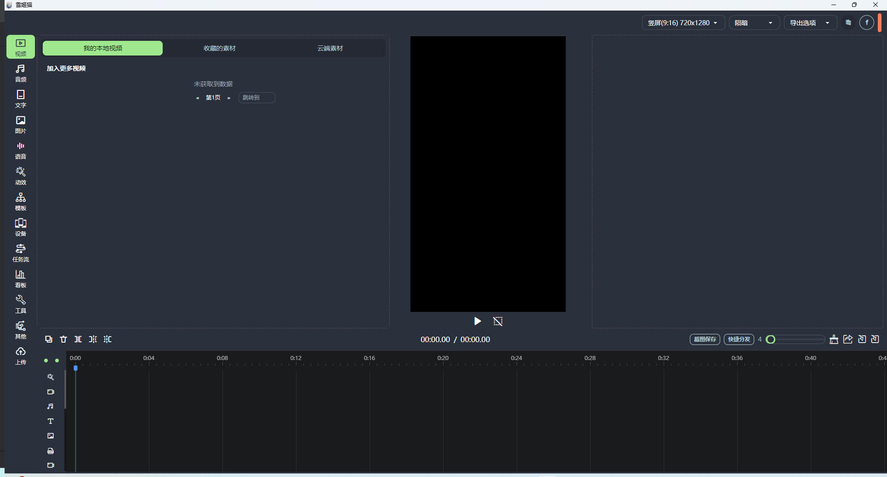
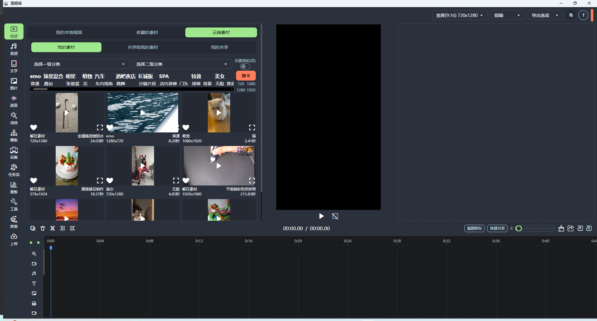

# 雪姬猫 短视频剪辑分发一体化软件 可用于群控或电商带货
## 警告 当前为开发模式 随时会变化或不可用

## 特点
- 模板可以批量大规模产出混剪视频
  - 模板支持分享与导入
- 工具支持
  - 本地视频音频分割
  - 视频分镜提取
  - 抖音作品下载
  - 视频字幕识别
  - 视频音频文案提取
- 海量云端素材
  - 明星
  - 萌宠
  - 美女
  - 花
  - 各类穿搭
  - 城市景色
  - 各种live现场
  - 风景
  - 酒吧夜店
  - 场景化的
    - 地铁站
    - 坐火车
    - 夜市
    - 盒饭
    - 走路
    - 骑自行车
    - 等等
  - 解压素材
    - 超20个T 市面上的应该都有
  - 并且支持与他人共享
  - 支持定制
- 海量云端音频
- 支持TTS和STT
- 支持基于`usb`的设备管理
  - 设备画面可视
- ~~支持基于`浏览器`的设备管理~~
  - ~~目前在灰度中 暂支持抖音~~
- 支持基于`自制APP`的设备管理
  - 在手机上安装官方APP 可以自行写任务控制手机
  - 也可以使用官方定义的控制
  - 内测中 联系客服开通
- 支持平台统计 作品阅读量 点赞 评论等
- 支持看板数据统计

## 更新历史
- 2025年4月18日
  - 去除浏览器的账号管理
    - 因为众所周知的原因 抖音对所有非app端上传的作品
      - 有很大概率0播 或卡播放 权重特别低 尽量不用了
  - 基于 `usb` 的设备管理 现在去掉其他选项动作 仅保留设备可视化操作
  - 大力支持 `雪姬猫安卓端app` 进行设备的在线和任务的分发动作
    - 需要安卓手机打开 `开发者选项`的`usb调试`
      - 小米需要打开 `usb安装` `usb调试(安全设置)`
  - 支持定制OS 隐藏放开 `开发者选项` 过特别严格的app 一般人用不到 
    - 暂只支持小米

## todo
- [] 雪姬猫安卓端app开放
- [] 电商带货模式集成

### 图片预览

构建时间：<!--BUILD_TIME-->2025-05-03 15:56:20<!--/BUILD_TIME-->
